# LeTac-MPC: Learning Model Predictive Control for Tactile-reactive Grasping

抓取任务是机器人中的一项关键任务, 这篇论文介绍了一种基于学习的触觉反应抓取模型预测控制(LeTac-MPC), 将触觉反馈和一个可学习的MPC层结合, 使得抓取任务能够根据不同物理性质, 形状, 大小的物体给予<strong>适当的力</strong>, 并且能<strong>实时响应</strong>(25Hz)。

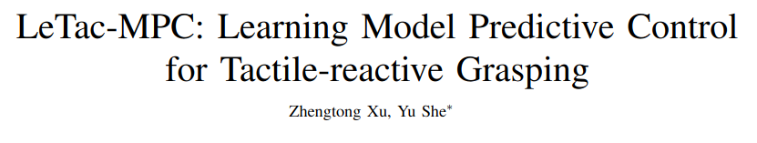

论文地址: https://arxiv.org/abs/2403.04934

机器人抓取任务有以下三个挑战: 

1. 复杂的物体物理属性。不同的物体可能具有不同的物理性质, 而现有的触觉感知方法通常假设被抓取的物体是刚性的, 并且基于视觉的触觉传感器可能对于较软的物体不太敏感, 这使得基于模型的控制器很难从触觉反馈中获得高质量并且稳定的信号, 并且模型的泛化能力较弱。
2. 动态抓取与力的交互。在动态抓取任务中, 被抓取的物体可能会受到惯性力和意外碰撞, 如果抓取器反应不够灵敏, 物体可能会从抓手中掉落。此外, 如果使用较大的抓取力, 可能会破坏相对脆弱的物体。因此, 设计一个能够根据物体的物理属性和状态来调整抓取力的控制器是一个挑战。
3. 高分辨率触觉反馈的集成。传统的控制方法基于低维反馈信号, 需要从触觉图像中提取所需信息进行降维, 但许多特征提取方法都对物体的物理属性和形状做了假设, 难以泛化应用到不同的物体。此外, 基于机器学习的方法虽然可以处理高维观测量, 如视觉和触觉图像, 但往往忽略了收敛性, 响应速度, 控制频率和约束条件, 因此不太适合需要快速反应的任务。

因此, 作者提出了LeTac-MPC, 一种基于学习的模型预测控制(MPC)方法用于触觉反应性抓取。该控制器可以在25Hz的频率下运行, 并且可以根据不同物体动态调节力的大小。

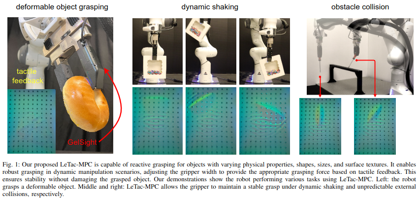

## 1. 相关工作

作者从三个方面(触觉控制, 触觉抓取, 学习用于操控的物理特性)介绍在控制和学习中利用触觉传感器的先前研究。
在触觉控制方面, 先前的方法假设物体为刚性物体, 因此无法泛化到具有不同物理特性的物体上。
最近提出的一种学习软触觉传感器膜动力学的方法, 但该方法未考虑被操控物体的动力学。
还有一种基于学习的触觉MPC框架, 但由于使用了视频预测模型, 不适用于实时控制任务。
在触觉抓取方面, 先前基于神经网络的方法没有关注控制的实时性, 未考虑收敛性, 响应速度, 控制频率和约束等方面。
因此, 这些方法不是适用于实时控制。
在学习用于操控的物理特性方面, 基于学习的方法结合触觉和视觉反馈的方法不适合需要反应行为的任务方法。
利用神经辐射场来操控具有复杂特性的物体的方法, 不具有实时性。
基于学习的实时触觉控制方法, 没有研究用于软和可变形物体的实时触觉控制器。

## 2. 方法

本文提出的基于学习的模型预测控制(MPC)用于触觉反应抓取的详细方法。

### 2.1 触觉信息编码 

使用基于视觉的触觉传感器GelSight, 该传感器可以提供接触表面几何形状和应变场的高分辨率图像。
为了提取被抓取物体的状态和物理特性, 采用卷积神经网络和多层感知机将触觉图像编码为低维嵌入向量。
具体实现中, 使用预训练的ResNet-152作为CNN架构, 并将其最后一层替换为带有ReLU激活的两层MLP。

### 2.2 可微分MPC层

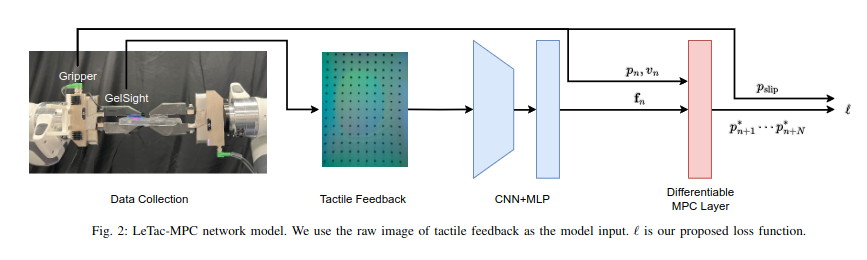

设计了一个MPC层以利用从神经网络中提取的嵌入向量进行控制器设计。
在本文中，考虑了一种具有单自由度线性运动的两指夹爪。
通过MPC层解决优化问题，使得控制器能够以25Hz的频率运行，从而实现对各种日常物品的动态和力交互任务的稳健反应抓取。

### 2.3 训练 

对于MPC层, 选择了需要学习的参数A_f​和Q_f, 而其它基于模型的控制参数Q_v, Q_a和 P 直接分配合理的数值。由于优化目标是二次规划问题, 作者证明了MPC层的可行性。具体来说, 保证得到的二次规划问题的Hessian矩阵是对称正定的。作者之后还给出了相应的损失函数。

### 2.4 数据收集

作者选用了四种不同类型的材料来进行数据收集, 为了简化数据收集过程, 数据集的物体均为标准化的无表面纹理块。

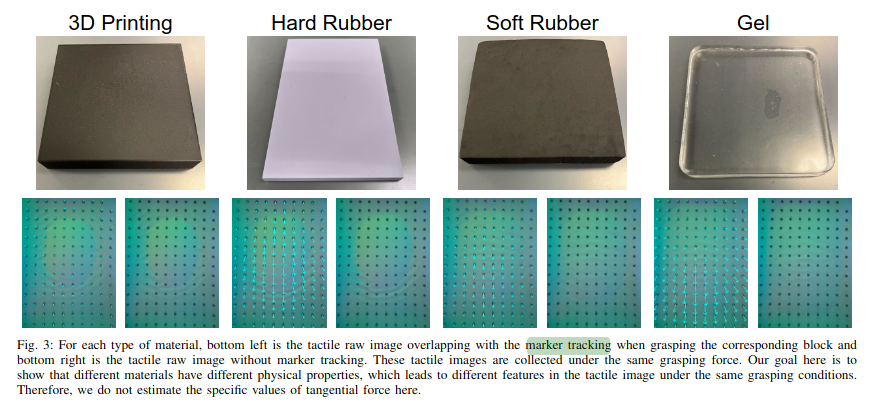

数据收集过程使用双臂设置进行数据收集, 其中一只手臂(领导臂)精确跟踪轨迹, 另一只手臂(跟随臂)实现阻抗控制。

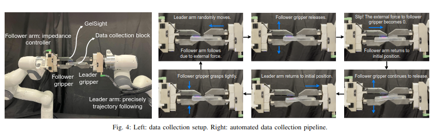

通过使领导臂移动来施加外力, 并且由于阻抗控制器, 跟随臂跟随其运动。随后, 逐渐释放跟随夹爪并记录触觉反馈。当跟随夹爪的抓力不足以克服外力发生滑动时, 记录此时的夹爪宽度。

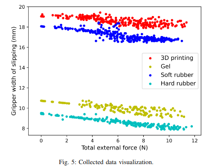

### 2.4 损失函数

作者设计了一个损失函数, 用于测量预测轨迹与目标位置之间的差异。

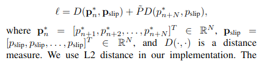

### 2.5 控制器实现

作者介绍了如何将训练好的模型部署为一个实时控制器, 并进行三项关键调整以确保其在实际应用中的表现。

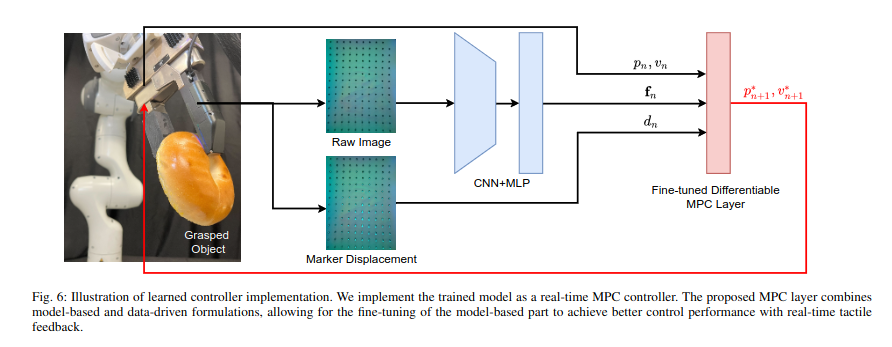

1. 作者在实现控制器时, 增加额外的系数来提高Q_v, Q_a的权重, 从而加快控制器的收敛速度。
2. 作者增加了一个额外的反馈信号——标记位移(marker displacement), 以提高对切向接触力的响应速度。从而提升控制器的性能。
3. 作者在优化问题中添加了夹爪运动的饱和约束，以确保控制输入和输出的动态可行性。

## 3. 基准方法 

作者介绍了实验中用于比较的三种基准方法: 比例-微分(PD)控制, 模型预测控制(MPC), 开环抓取。这些基准方法作为对比用于评估LeTac-MPC方法在不同抓取任务中的性能, 涵盖了从传统控制方法到简单的开环策略, 为LeTac-MPC的性能提供了对比基准。

<!-- ### 3.1 PD 控制

作者定义以下公式: 

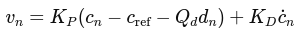

其中:
- v_n 为夹爪速度
- K_p, K_d 为比例增益和微分增益
- c_n 为当前接触面积, c_ref为期望接触面积
- d_n 为当前标记位移长度, Q_d 为 d 的标量因子
- dot{c}_n 为 c_n 的微分

作者使用以下参数:

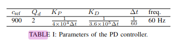

### 3.2 模型预测控制 (MPC)

MPC方法假设接触面积c和夹爪位置p之间存在线性关系：

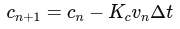

结合夹爪的运动模型, 实现对夹爪抓取过程的预测和优化控制。

### 3.2 开环抓取

开环抓取利用夹爪的力反馈作为选择夹爪宽度的信号。具体操作如下:
- 抓取开始时, 夹爪宽度减小, 直到力反馈超过10N时停止。
- 在执行任务期间, 夹爪宽度保持不变。 -->

## 4. 实验

作者介绍了在WSG 50-110并行夹爪和Franka Panda机械臂上进行的实验, 验证了LeTac-MPC方法的有效性, 并与基准方法进行了比较。实验分为三个主要任务: 日常物品抓取和运输, 动态摇晃, 障碍碰撞。

### 4.1 日常物品抓取和运输
作者选用了10种日常物品进行抓取和运输测试

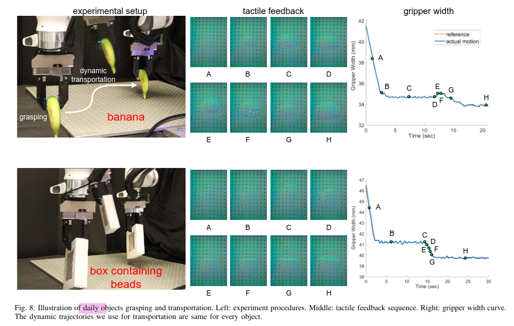

结果如下:

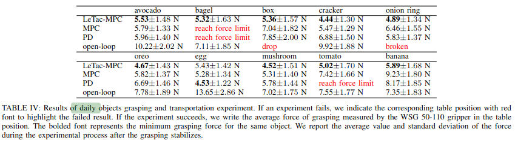

从结果上看LeTac-MPC能够实现对不同物体的稳健抓取, 且抓取力最小。PD和MPC方法在抓取易形变物体时, 由于接触面积反馈信号不稳定, 表现不佳。开环抓取方法虽然简单, 但无法在动态过程中调整抓取力, 导致某些物体掉落或损坏。

### 4.2 动态摇晃

这一实验模拟了夹爪在动态摇晃情况下的抓取稳定性测试。实验结果如下:

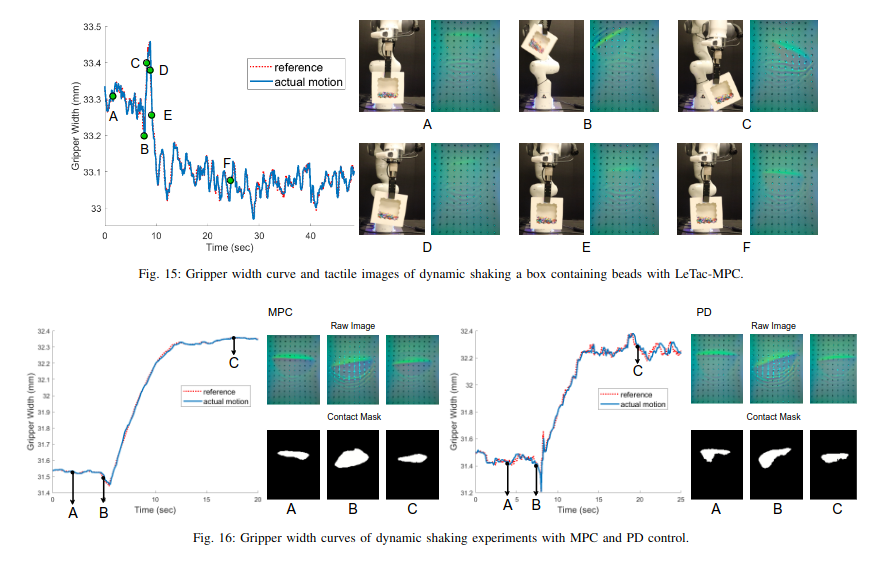

实验结果表明, LeTac-MPC在动态摇晃过程中能够有效调整夹爪抓力, 保持物体稳定, 而PD和MPC由于响应较慢或反馈信号不稳定, 表现较差。

### 4.3 障碍碰撞

此实验测试了夹爪在意外碰撞情况下的反应能力

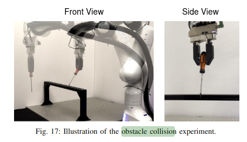

结果如下:

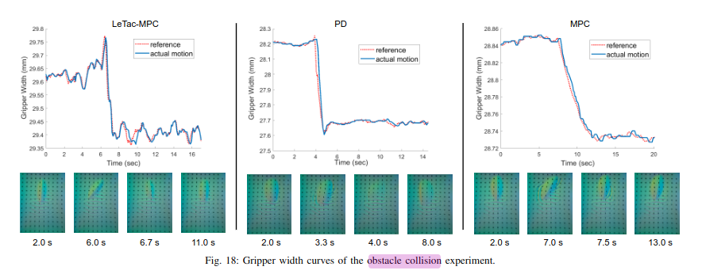

实验结果表明, 虽然LeTac-MPC在收敛过程中有一定波动, 但是波动范围在+-0.05mm左右, 是可以被接受的。并且此方法在碰撞情况下能够迅速调整夹爪抓力, 避免物体掉落, 而其他方法由于缺乏快速反应能力, 表现不佳。

## 5. 讨论与未来的工作

- 性能分析
    1. LeTac-MPC结合了神经网络和可微分MPC层, 实现了对具有不同物理特性, 形状, 大小物体的稳健抓取。
    2. 在日常物品抓取, 动态摇晃, 障碍碰撞实验中, LeTac-MPC表现出了比PD控制和MPC方法更高的稳定性和适应性。
    3. LeTac-MPC通过最小化抓取力, 实现了对脆弱物体的保护, 而PD控制和MPC方法在处理变形物体时往往需要施加较大的力, 容易损坏物体。
- 局限性
    1. 虽然LeTac-MPC在处理各种物体时表现出色, 但在极端条件下(如非常软的物体)仍可能面临反馈信号不稳定的问题。
    2. 尽管LeTac-MPC的响应速度优于传统方法, 但仍有提升空间, 特别是在更高频率的动态任务中。

作者指出未来的潜在研究方向有:

- 提升模型泛化能力
- 优化实时性能
- 多模态传感融合
- 实际应用拓展

这些改进和扩展将有助于推动机器人触觉抓取技术的发展, 使其在更多实际场景中发挥作用。