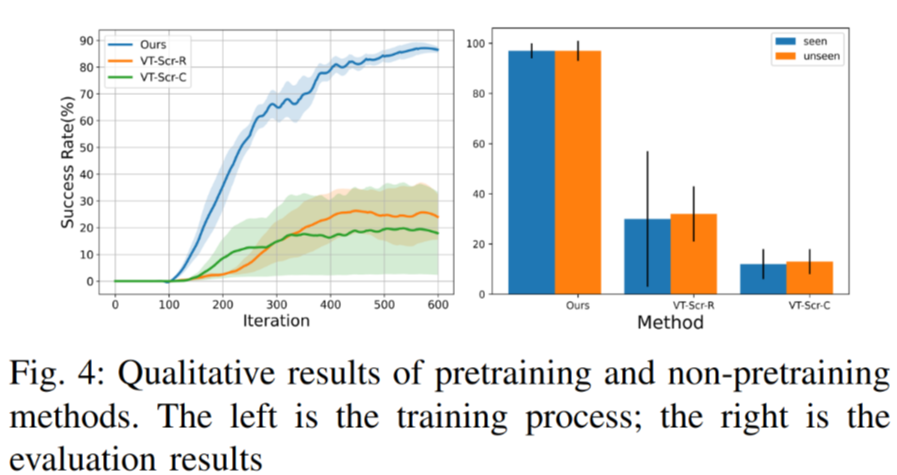

# ICRA 2024: Masked Visual-Tactile Pre-training for Robot Manipulation

先前的关于机器人操作的预训练工作表明, 从大量人类操作数据中学习到的内容, 可以很好地泛化到新的操作任务以及操作环境当中。然而, 先前的方法主要集中在人类视觉或者自然语言方面, 忽视了触觉反馈。在本文中, 作者探索了如何使用人类的视觉和触觉数据来训练机器人操作的预训练模型。

首先作者建立了一个低成本的视觉触觉数据采集系统, 收集了人类的视觉触觉操作数据集, 并使用一个名为 $\small M^2VTP$ 的模型来进行预训练的学习。随后作者将预训练的模型集成到强化学习框架中, 用于机器人操作。实验结果表明, 与基准方法相比, 作者的方法在学习操作技能方面具有显著的效果。此外, 与当前的视觉预训练方法相比, 作者的方法的成功率 **提高了 50%** 以上。论文还提出了未来的研究方向, 包括建立更灵活和高质量的数据采集系统、收集更广泛场景的大规模多模态人类操作数据集、研究不仅限于视觉和触觉的多模态融合模型, 以及在更多视觉触觉任务上进行研究。

## 1. 相关工作

作者从三个方面（机器人预训练, 用触觉信息进行操作, 融合触觉信息的模型）分析以往的机器人操作预训练相关的工作。目前的预训练方法主要集中在人类视觉或自然语言方面, 忽视了触觉反馈。作者提到了一些使用视觉预训练的方法, 如自监督学习和增强学习。然而, 这些方法都没有考虑到触觉信息的重要性。作者还提到了一些使用触觉预训练的方法, 如使用触觉数据进行逆向模型学习和使用触觉数据进行自监督学习。然而, 这些方法都没有充分利用视觉信息。因此, 本文的方法是首次将视觉和触觉数据结合起来进行预训练。

## 2. 方法

本文介绍了如何制作低成本的触觉手套和建立视觉触觉采集系统, 以收集用于人类操作的视觉触觉数据集。然后, 本文提出了一种全新的视觉触觉融合框架 $\small M^2VTP$, 用于融合视觉和触觉模态。接下来, 本文将预训练模型嵌入到强化学习结构中, 提取视觉触觉潜在表示, 使智能体能够理解环境中的下游任务。

### 2.1 用于人类操作的视觉触觉收集系统

文中视觉触觉收集系统主要分为三个部件：

触觉手套、HoloLens2 和中央计算机。触觉手套使用低成本的商用电阻式压力传感器, 共有 20 个传感器分布在手部各个关键部位。这些传感器通过电阻-电压转换模块连接, 将电阻信号转换为电压信号。为了保证每个传感器在接触时记录的电压值大致相等, 可以通过调节转换模块上的电位器来实现。HoloLens2 用于捕捉 RGB 图像, 分辨率为 424x240 像素, 帧率为 30 帧/秒。为了对齐视觉和触觉数据, 中央计算机记录了从这两个采集源接收到的信号的时间戳, 并将这些时间戳与本地时间戳进行对应。视觉和触觉数据的对齐依赖于中央计算机记录的时间戳, 将每个图像帧与相应的触觉帧同步, 形成匹配的数据对。

### 2.2 用于预训练的 Masked Visual-tactile Transforme

如上图所示, 作者拓展了传统的 MAE, 同时将视觉和触觉数据进行编码。该网络包含了一个视觉-触觉编码器 $E_\theta$ 和一个视觉-触觉重构器 $D_\theta$。$E_\theta$ 由三个部分组成:视觉特征提取器 $F_{\theta_v}$ 、触觉特征提取器 $F_{\theta_c}$ 和视觉-触觉融合块 $B_{\theta_{vc}}$。 $F_{\theta_v}$ 基于 MAE 框架, 从输入图像中生成可见的视觉嵌入。 $F_{\theta_c}$ 将每个触觉传感器的接触值映射到嵌入, 并引入位置编码。 $B_{\theta_{vc}}$ 负责整合视觉和触觉特征。 $D_\theta$ 由三个部分组成:视觉-触觉重构块 $R_{\theta_{vc}}$ 、视觉重构器 $R_{\theta_v}$ 和触觉重构器 $R_{\theta_c}$。它根据编码器的输出和掩码标记重构图像和触觉数据。该模型的目标函数同时包含图像和触觉数据的重构损失, 以实现视觉-触觉特征的联合学习。

### 2.3 用于操作的视觉-触觉强化学习

作者将视觉-触觉操作任务建模为马尔科夫决策过程, 包括状态空间 $S$, 动作空间 $A$, 转移矩阵 $T$, 奖励函数 $R$, 以及折扣因子 $\gamma$, 目标是训练一个策略网络 $\pi_\theta$, 以最大化预期折扣奖励 $J(\pi)$。

作者设置了一个瓶盖旋转任务, 使用 Shadow Hand 机器人手作为操作器。状态空间包括预训练的视觉-触觉编码器 $E_{\theta_f}$ 的输出和机器人手关节位置和速度。动作空间为 20 维, 对应 Shadow Hand 的 20 个自由度。

方法是将预训练的视觉-触觉编码器 $E_{\theta_f}$ 嵌入状态空间 $S$ 中, 利用预训练模型的感知能力, 减轻策略网络的学习负担。

## 3. 实验结论

作者为了验证提出的视觉-触觉融合方法 $\rightarrow \small M^2VTP$ 在下游机器人操作任务中的有效性, 提出了三个问题：

1. 与未预训练的方法相比, $\small M^2VTP$ 是否更有效？
1. 与单模态预训练相比, $\small M^2VTP$ 是否能更好地辅助操作任务？
1. 为什么融合触觉信息的 $\small M^2VTP$ 更有效？怎么解释这种现象？

### 3.1 实验设置

作者设计实验如下：

- 数据集：收集了 20 种不同的瓶子, 使用视觉-触觉采集系统获得 120 个开关瓶盖的视频, 共 30087 帧。每帧图像对应 20 维二值触觉数据。
- 评价指标：成功率, 当机器人手旋转瓶盖超过半圈时算成功。在 10 个已见瓶子上测试 200 次, 5 个未见瓶子上测试 100 次。
- 实现细节：在预训练阶段使用 AdamW 优化器, 训练 400 个 epoch。在 RL 阶段使用 PPO 算法, 训练 600 次。

### 3.2 基准

- VT-Scr-C：从头训练 CNN 提取视觉特征, 与触觉特征拼接输入策略网络。
- VT-Scr-R：与 VT-Scr-C 类似, 但使用 ResNet18 提取视觉特征。
- V-Only：仅使用视觉信息, 基于 Voltron 预训练模型进行微调。
- T-Only：仅使用触觉信息, 从头训练。
- MVP： 直接应用预训练的 MVP 模型到 RL 框架, 不进行微调。
- VT-Sep：分别训练视觉模型和触觉模型, 然后将特征拼接输入策略网络。

### 3.3 预训练的有效性

与未预训练的方法相比, $\small M^2VTP$ 在训练过程和评估结果上都表现更好, 突出了预训练方法的重要性。

#### 3.4 视觉-触觉融合的有效性

与仅使用单一模态的方法相比, $\small M^2VTP$ 融合视觉-触觉信息, 在学习速度和任务效果上都有超过 10% 的提升。特别是在存在视觉遮挡的情况下, 仅依赖视觉的方法表现较差, 而仅依赖触觉的方法表现较强, 突出了触觉信息的重要作用。

#### 3.5 消融实验

由上图, 

- 触觉分块数量：将 20 个触觉传感器分成 20 个 patch 效果最佳。
- 重构目标：同时重构视觉和触觉数据效果最佳, 仅重构触觉数据效果最差。
- 触觉位置编码：加入触觉位置编码可以提高操作成功率超过 20%。

#### 3.6 可视化视觉-触觉融合

作者还提供了可视化的 Attention Map 如下：

### 4 讨论

在本文中, 作者初步探索了使用人类视觉和触觉数据来预训练机器人操作模型的潜力, 证明了该方法的有效性, 未来会尝试更多工作, 包括：

1. 建立更灵活与更高质量的无线的数据收集系统。
2. 覆盖更广泛场景的大规模多模态人体操作数据。
3. 不只局限于视觉和触觉的多模态融合模型。
4. 一个更多视觉-触觉任务的平台。
