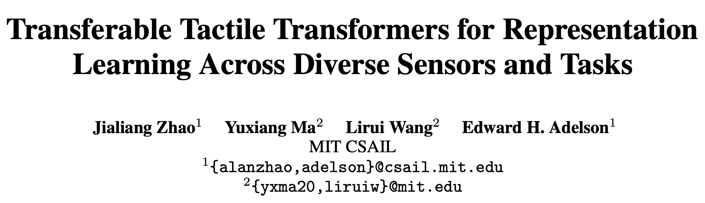
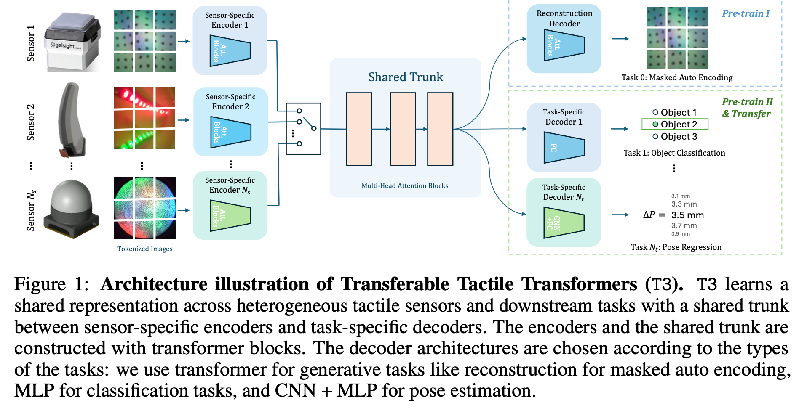
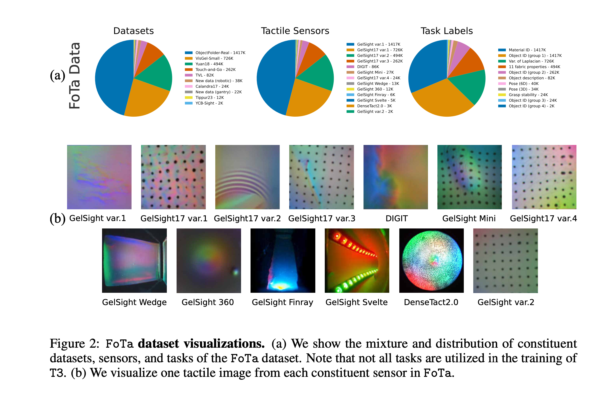
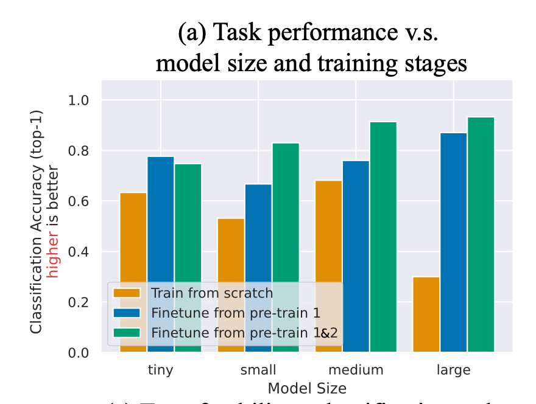
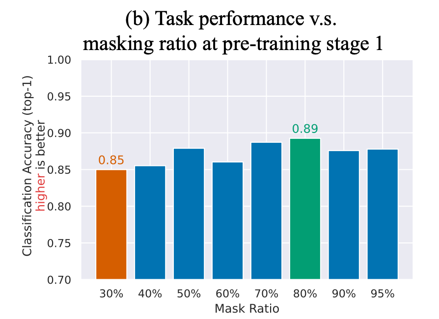
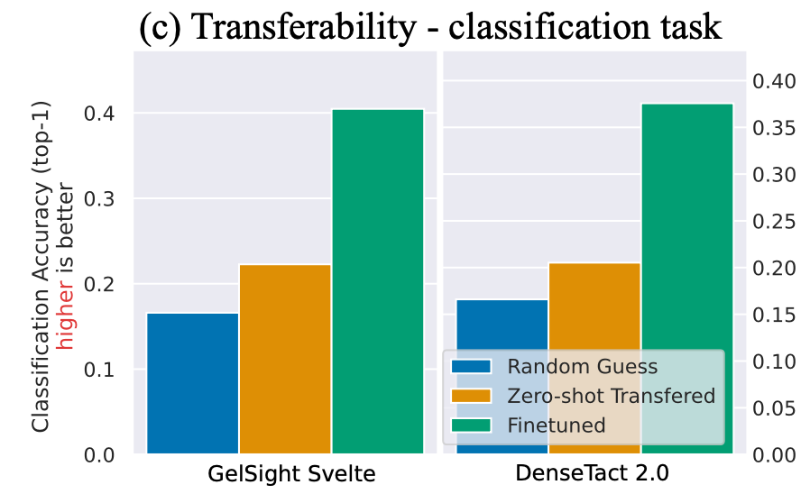
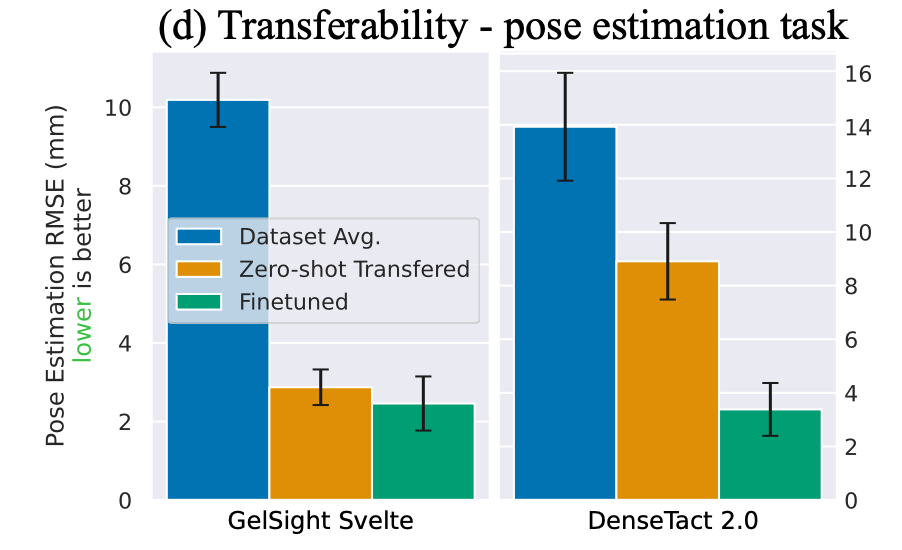
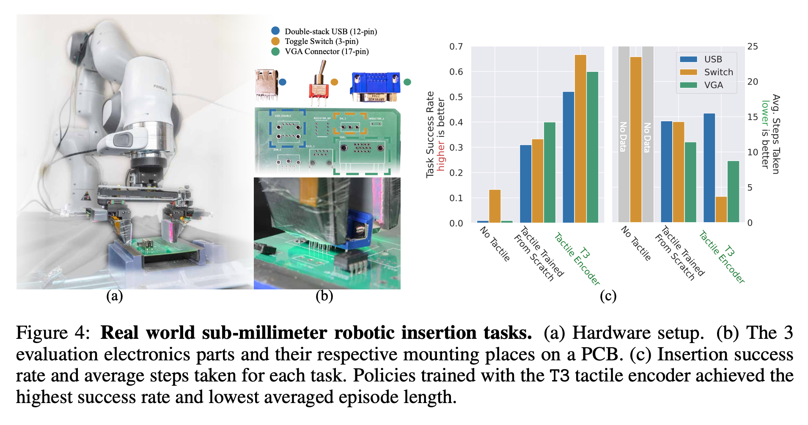

# MIT: 跨多种传感器和任务的可转移触觉Transformers表征学习

近日，MIT的研究人员提出了一种名为T3（Transferable Tactile Transformers）的框架，用于触觉表征学习，能够跨多种传感器和任务进行扩展。T3的提出旨在解决当前基于摄像头的触觉感知系统高度异构的问题，即不同的传感器形状，摄像头类型和数据集任务各不相同。

T3通过构建具有传感器特定编码器和任务特定解码器的共享主干Transformer，捕捉了不同传感器任务对之间的共享潜在信息。

## 1. 介绍

目前，现有的学习框架和数据集通常专注于特定的传感器和任务组合，当新的传感器或者任务出现时，需要重新收集数据并且从头开始训练模型。并且由于长时间操作任务的触觉编码器训练依赖稀疏的奖励信号，所以这类操作任务的训练效率很低。尽管不同触觉传感器生成的触觉图像差异显著，不同任务从触觉输入中提取的信息各不相同，但触觉感知的内在相似性意味着应存在可共享的潜在信息。所以，设计一种能够提取共享潜在表征并在不同传感器和任务之间转移的架构是技术上可行且实际需要的。

本文提出的T3架构，旨在解决上述问题。

## 2. 相关工作

基于摄像头的触觉传感器具体的设计选择多种多样，使得传感器能够适应各种任务，但由于每个传感器-任务组合都需要重新收集数据并且重新训练，也就增加了信息编码的难度。

近年来发布的多个大规模触觉感知数据集，涵盖了包括视觉-触觉跨模态推理，物体/材料分类等，在数量上不成问题，但是它们在传感器和任务方面缺乏多样性，大多数数据集只涵盖了特定的触觉传感器数据，限制了预训练模型在新传感器上的迁移能力。

学习异构数据多表征在机器人学习领域是一项活跃的研究，通过结合多种感官反馈来预测输出。现有的方法包括使用对比学习连接时间对齐的模态，设计多模态自注意机制学习共享表征，生成对抗网络预测不同模态间的映射，应用掩码自动编码器（MAE）在多模态输入上学习共享表征等。然而异构触觉表征学习与多模态表征学习的一个显著不同之处在于其缺乏用不同传感器为不同任务收集的对其数据。

## 3. FoTa数据库

Foundation Tactile (FoTa) 数据集是目前为止最大且最具多样性的触觉数据集，包含300万个数据点，这些数据点由13种触觉传感器在11个任务中收集。

这些数据一部分来源于多个开源数据集，一部分来源于作者使用"7自由robotic平台"和"3自由度gantry平台"自行收集的数据。其涵盖了多种不同的触觉传感器和任务，为训练通用触觉表征模型提供了丰富的数据支持。

## 4. 用T3进行异构触觉学习

本节作者提出T3架构，其由多个部分组成：传感器特定的编码器、共享的主干（Trunk）和任务特定的解码器。对于每个传感器-任务对，分别连接到对应的编码器和解码器到共享主干。编码器和主干使用ViT块，而解码器根据任务类型选择不同架构：

- 生成任务使用ViT
- 分类任务使用MLP
- 姿态估计任务使用CNN和MLP组合

每个任务都有特定的损失函数，训练过程中，传感器特定的编码器提取特征，经过共享主干处理后，再通过任务特定的解码器进行预测。

在预训练1阶段，使用掩码自动编码（MAE）进行自监督学习，通过重建部分遮挡的输入图像来训练模型。

在预训练2阶段，使用FoTa数据集中带有明确任务标签的数据进行监督学习，定义了10个任务，包括物体分类、材料分类、布料平滑度和模糊度分类、姿态估计等。

Fine-tuning阶段，对于特定下游任务和传感器，进一步使用少量数据进行微调，以提高模型在特定任务和传感器上的表现。

## 5. 实验与讨论

本节通过多种实验和对比验证了T3的有效性，并探讨了，预训练的价值，零样本抽象迁移能力，长期操作任务中的表现，三个话题。

### 5.1 预训练的价值

作者的实验表明，预训练显著提升了模型的评估精度。无论是哪个网络配置，预训练后的模型表现都比从头训练的模型好，平均提升了31%。并且模型规模越大，性能越好。大规模模型（Large）的分类准确率比小规模模型（Tiny）高出19%，但中等规模（Medium）和大规模模型的性能差异不显著。

以及在预训练1阶段MAE的mask比例为80%时分类准确率最高，达到89%

### 5.2 零样本迁移能力

在分类任务中，在未经微调的情况下，零样本迁移效果仅略优于随机猜测。经过微调后，分类准确率显著提升。

在姿态估计任务中，零样本迁移在姿态估计任务中表现出色，经过微调后，DenseTact2.0的均方根误差（RMSE）降低了5.5mm。

### 5.3 长期操作任务中的表现

作者设计了一个机器人精密插入任务。使用包括两个GelSight Wedge触觉传感器，一个Franka Emika Panda机器人臂，一个固定的PCB板和三个电子部件。通过触觉感知将亚毫米级电子部件插入PCB对应位置。

结果表明，使用T3编码器的策略在所有三个部件的插入任务中表现最佳，成功率最高，所需操作步骤最少。与无触觉感知的基准策略相比，成功率提高53%；与从头训练的触觉编码器策略相比，成功率提高25%。

总结：

- 预训练显著提高了模型在分类和回归任务中的性能，特别是在网络规模较大的情况下表现更佳。
- T3在某些任务中展示了零样本迁移能力，经过少量微调后性能进一步提升。
- T3在长期操作任务中展示了显著的优势，证明了其在实际机器人操作中的应用潜力。

## 6. 局限性以及未来工作

尽管T3在多传感器和多任务触觉表征学习中展示了显著的性能优势，但在数据集平衡性和模型架构上仍有改进空间。例如FoTa数据集中的数据主要集中在少数几种流行的传感器上，占据了数据集的一半以上，这可能会导致训练出来的模型更偏向于流行的传感器，从而影响其他传感器的性能。此外，T3架构主要关注的是单张图片的编码，而没有考虑触觉图像序列的表征学习。

未来工作将致力于优化数据集和模型架构，并探索其在更广泛应用中的潜力，以推动触觉感知技术的发展。

## 7. 总结

本文提出了T3，一个基于摄像头的触觉感知框架，能够在多个传感器和任务之间进行迁移；并提出了FoTa，这是目前数量最多且传感器和下游任务最为多样的触觉数据集。实验结果表明，利用FoTa预训练的T3能够提高各种任务的性能，包括长期操作任务，如亚毫米级电子插入任务，并且T3能够在少量微调下迁移到新的传感器任务配对中。
